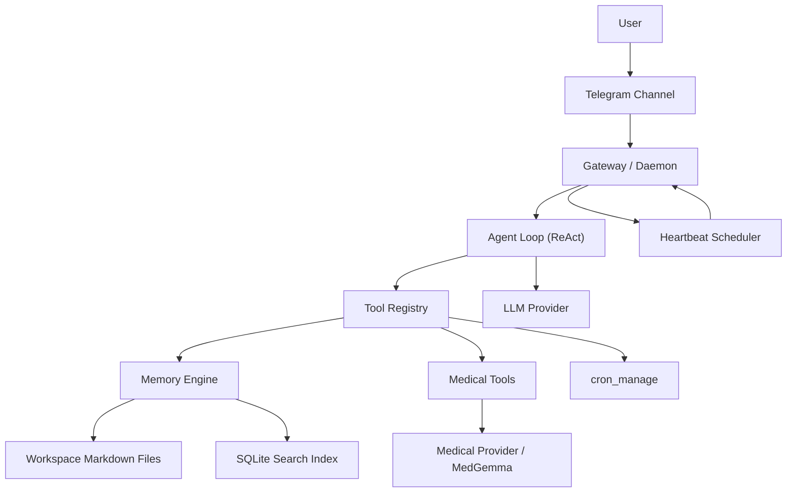

# MedClaw: Personal Health AI Agent

MedClaw is a local-first personal health AI agent built with TypeScript and Node.js. It combines persistent health memory, medical reasoning tools, report ingestion, and proactive heartbeats so the assistant can talk with context instead of starting from zero every time.

It is designed as a modular, self-hosted system:
- Telegram for chat
- Ollama or compatible providers for models
- Markdown workspace files as the source of truth
- SQLite for search and indexing
- A raw ReAct agent loop with configurable tools

## Demo Video: 
- [ X ](https://x.com/shridhar600/status/2046349242076393915?s=20) 
- [GDrive](https://drive.google.com/file/d/1d80IOSn7wuJbzLOQhFsxmdYTfUDNkpEp/view?usp=sharing)

## What It Can Do

- Chat as a persistent personal health assistant over Telegram
- Maintain long-term context from local health files and daily logs
- Search relevant memory and condition history during conversations
- Analyze uploaded medical reports, including supported text, PDF, and image files
- Store session traces on disk and resume context across restarts
- Create and manage heartbeat reminders
- Run scheduled medication or check-in prompts through the same agent pipeline
- Initialize local config/workspace and inspect runtime state from a local CLI

## Core Capabilities

- **Local-first memory**
  Health context lives in Markdown files under the workspace. Search is powered by SQLite, but the files remain the primary source of truth.

- **Medical reasoning tools**
  The main agent can call MedGemma-backed tools for health Q&A and report analysis.

- **Context-rich conversations**
  The assistant loads core files like `SOUL.md`, `HEALTH_PROFILE.md`, `USER.md`, and `HEARTBEAT.md`, plus recent logs and retrieved memory when needed.

- **Proactive heartbeats**
  Recurring reminders and policy-driven health check-ins run through the scheduler, gateway, agent loop, and channel pipeline.

- **Session persistence**
  Active chats are stored as JSONL, reloaded on restart, compacted when idle, and archived on hard reset.

## Why MedGemma Makes MedClaw Different

MedClaw is not just a generic chatbot with a health-themed prompt. It has a dedicated medical reasoning path.

- Health questions can be routed to MedGemma-backed tools instead of relying only on the main conversation model.
- MedGemma calls are enriched with user health context from `HEALTH_PROFILE.md` plus relevant retrieved memories.
- Report analysis is handled as a medical workflow instead of a plain file-summary workflow.
- If MedGemma is unavailable, the system falls back only to a local main provider by default, so medical context is not silently sent to a non-local generic model.

That is what makes the assistant feel more domain-specific: the health path is not an afterthought, it is a first-class part of the architecture.

## Architecture



## Runtime Flow

1. A Telegram message reaches the gateway.
2. If first-user onboarding is incomplete, the gateway collects durable profile context before the normal agent loop. Urgent emergency phrasing bypasses onboarding.
3. The gateway assembles session history and agent input.
4. The agent loop calls the configured LLM.
5. If the LLM requests a tool, the tool registry executes it and returns the result to the loop.
6. The final response is sent back to Telegram and persisted to session storage.
7. Scheduled heartbeats use the same gateway and agent path, so proactive messages follow the same reasoning and memory flow as normal chat.

## How Memory Actually Works

MedClaw’s memory is more than “some notes in files”.

- Core files such as `SOUL.md`, `HEALTH_PROFILE.md`, `USER.md`, and `HEARTBEAT.md` are loaded into the agent context every turn.
- Daily health logs are stored in `memory/YYYY-MM-DD.md`, with today and yesterday prioritized in context assembly.
- Structured health knowledge is split across folders like `conditions/`, `medications/`, `reports/`, and `goals/`.
- A memory indexer scans the workspace, chunks files, embeds them, and stores search metadata in SQLite.
- Search is hybrid: semantic vector search plus keyword search, so the agent can retrieve relevant fragments instead of dumping whole files into context.
- Session traces are stored separately as JSONL so the assistant can preserve conversation continuity while still compacting what the model sees.

The result is a layered memory system:
- Markdown files for durable truth
- SQLite for retrieval
- session logs for conversational continuity
- context assembly for turning all of that into something the model can actually use

## Workspace Layout

```text
~/.redacted/workspace/
├── SOUL.md
├── HEALTH_PROFILE.md
├── USER.md
├── HEARTBEAT.md
├── MEMORY.md
├── conditions/
├── medications/
├── reports/
├── goals/
├── memory/
├── summaries/
└── archive/
```

## Tech Stack

- TypeScript
- Node.js
- grammY
- Ollama
- better-sqlite3
- sqlite-vec
- Jest

## Quick Start

### Prerequisites

- Node.js installed
- Ollama installed and running for the default local setup
- Telegram bot token available if you want Telegram enabled
- OpenAI API key only if you choose the OpenAI setup profile

### Install

```bash
npm install
```

### Start Ollama

```bash
ollama serve
```

### Pull models

```bash
ollama pull kimi-k2.5:cloud
ollama pull aadide/medgemma-1.5-4b-it-Q4_K_S:latest
ollama pull embeddinggemma:latest
```

### Initialize local config and workspace

Run the service onboarding CLI before starting the daemon:

```bash
npm run cli -- onboard
```

For non-interactive local setup without Telegram:

```bash
npm run cli -- onboard --yes --provider ollama --telegram-enabled false
```

If Telegram is enabled, provide a token via the prompt, `--telegram-token`, or `TELEGRAM_BOT_TOKEN`. CLI output redacts secrets.

### Telegram bot setup

1. Open Telegram and talk to `@BotFather`
2. Run `/newbot`
3. Choose a bot name and username
4. Copy the bot token
5. Run `npm run cli -- onboard` and enable Telegram when prompted

Then start the daemon and send your bot a message. On a fresh workspace, first chat collects basic profile context and writes it locally to `USER.md`, `HEALTH_PROFILE.md`, and onboarding state.

### Run the project

```bash
npm run start
```

The daemon reads `REDACTED_CONFIG_PATH` when set; otherwise it uses `~/.redacted/config.json`. If the resolved config file is missing, initialize with `npm run cli -- onboard`. Use `npm run dev` for watch-mode development.

## Configuration

The app reads configuration from:

```text
~/.redacted/config.json
```

Key areas:
- model/provider selection
- Telegram bot configuration
- memory workspace path
- session behavior
- heartbeat settings and timezone
- tool allow/deny controls

Admin CLI examples:

```bash
npm run cli -- status
npm run cli -- config show
npm run cli -- config set providers.main.model kimi-k2.5:cloud
npm run cli -- profile show
npm run cli -- user summary
npm run cli -- heartbeats list
```

## Useful Commands

```bash
npm run start
npm run dev
npm run dev:cli
npm run build
npm run typecheck
npm run lint
npm run test
npm run cli -- --help
npm run cli -- status
npm run cli -- config show
npm run cli -- config set <path> <value>
npm run cli -- profile show
npm run cli -- user summary
npm run cli -- heartbeats list
```

## Current MVP Scope

MedClaw is already usable as an MVP for:
- personal health chat with persistent context
- guided service setup and first-user profile onboarding
- memory-backed conversations
- medical report ingestion for supported text, PDF, and image files
- local health data organization
- heartbeat reminders and scheduled check-ins when heartbeats and a delivery channel are enabled

## Current Limits

- Report analysis supports files under `workspace/reports/`: text files (`.txt`, `.md`, `.csv`, `.json`, `.log`), text PDFs, scanned PDFs rendered to page images, and PNG/JPEG images. Image/scanned-PDF analysis requires a vision-capable medical provider such as a local MedGemma vision model; raw media is sent only to a local Ollama medical endpoint by default, and any non-local raw-media processing is opt-in only.
- If the medical provider fails, health-context fallbacks are allowed only to a local main provider by default. The system does not silently send medical context or extracted report text to a non-local generic provider.
- External health-system integrations are not part of the current MVP yet.
- The current admin surface is a local CLI, not a web dashboard.

## Deferred Future Scope

Deferred integration and platform work:

- Open Wearables integration
- FHIR integration
- Apple Health parsing
- appointments and calendar integrations
- wearable-triggered and provider-record-triggered proactive workflows
- natural-language scheduling improvements
- multi-channel proactive delivery
- `web_search` tool
- `exec` / CLI tool
- `sessions_spawn` for true sub-agents
- multi-model fallback
- Anthropic native provider

MedClaw is a personal health companion, not a replacement for a licensed medical professional. It should be used to organize context, assist with understanding, and support follow-up conversations, not as a definitive diagnostic authority.
