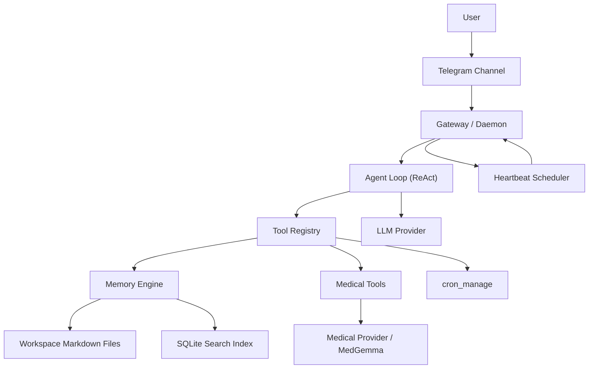

# MedClaw: Personal Health AI Agent

MedClaw is a local-first personal health AI agent built with TypeScript and Node.js. It combines persistent health memory, medical reasoning tools, report ingestion, and proactive heartbeats so the assistant can talk with context instead of starting from zero every time.

It is designed as a modular, self-hosted system:
- Telegram for chat
- Ollama or compatible providers for models
- Markdown workspace files as the source of truth
- SQLite for search and indexing
- A raw ReAct agent loop with configurable tools

## What It Can Do

- Chat as a persistent personal health assistant over Telegram
- Maintain long-term context from local health files and daily logs
- Search relevant memory and condition history during conversations
- Analyze uploaded **text-based** reports and use the results in later conversations
- Store session traces on disk and resume context across restarts
- Create and manage heartbeat reminders
- Run scheduled medication or check-in prompts through the same agent pipeline

## Core Capabilities

- **Local-first memory**
  Health context lives in Markdown files under the workspace. Search is powered by SQLite, but the files remain the primary source of truth.

- **Medical reasoning tools**
  The main agent can call MedGemma-backed tools for health Q&A and report analysis.

- **Context-rich conversations**
  The assistant loads core files like `SOUL.md`, `HEALTH_PROFILE.md`, `USER.md`, and `HEARTBEAT.md`, plus recent logs and retrieved memory when needed.

- **Proactive heartbeats**
  Recurring reminders and policy-driven health check-ins run through the scheduler, gateway, agent loop, and channel pipeline.

- **Session persistence**
  Active chats are stored as JSONL, reloaded on restart, compacted when idle, and archived on hard reset.

## Why MedGemma Makes MedClaw Different

MedClaw is not just a generic chatbot with a health-themed prompt. It has a dedicated medical reasoning path.

- Health questions can be routed to MedGemma-backed tools instead of relying only on the main conversation model.
- MedGemma calls are enriched with user health context from `HEALTH_PROFILE.md` plus relevant retrieved memories.
- Report analysis is handled as a medical workflow instead of a plain file-summary workflow.
- If MedGemma is unavailable, the system falls back gracefully, but the intended path is still medically grounded reasoning first.

That is what makes the assistant feel more domain-specific: the health path is not an afterthought, it is a first-class part of the architecture.

## Architecture



## Runtime Flow

1. A Telegram message reaches the gateway.
2. The gateway assembles session history and agent input.
3. The agent loop calls the configured LLM.
4. If the LLM requests a tool, the tool registry executes it and returns the result to the loop.
5. The final response is sent back to Telegram and persisted to session storage.
6. Scheduled heartbeats use the same gateway and agent path, so proactive messages follow the same reasoning and memory flow as normal chat.

## How Memory Actually Works

MedClaw’s memory is more than “some notes in files”.

- Core files such as `SOUL.md`, `HEALTH_PROFILE.md`, `USER.md`, and `HEARTBEAT.md` are loaded into the agent context every turn.
- Daily health logs are stored in `memory/YYYY-MM-DD.md`, with today and yesterday prioritized in context assembly.
- Structured health knowledge is split across folders like `conditions/`, `medications/`, `reports/`, and `goals/`.
- A memory indexer scans the workspace, chunks files, embeds them, and stores search metadata in SQLite.
- Search is hybrid: semantic vector search plus keyword search, so the agent can retrieve relevant fragments instead of dumping whole files into context.
- Session traces are stored separately as JSONL so the assistant can preserve conversation continuity while still compacting what the model sees.

The result is a layered memory system:
- Markdown files for durable truth
- SQLite for retrieval
- session logs for conversational continuity
- context assembly for turning all of that into something the model can actually use

## Workspace Layout

```text
~/.redacted/workspace/
├── SOUL.md
├── HEALTH_PROFILE.md
├── USER.md
├── HEARTBEAT.md
├── MEMORY.md
├── conditions/
├── medications/
├── reports/
├── goals/
└── memory/
```

## Tech Stack

- TypeScript
- Node.js
- grammY
- Ollama
- better-sqlite3
- sqlite-vec
- Jest

## Quick Start

### Prerequisites

- Node.js installed
- Ollama installed and running
- Telegram bot token available

### Install

```bash
npm install
```

### Start Ollama

```bash
ollama serve
```

### Pull models

```bash
ollama pull llama3.1
ollama pull amsaravi/medgemma-4b-it:q8
ollama pull nomic-embed-text
```

### Telegram bot setup

1. Open Telegram and talk to `@BotFather`
2. Run `/newbot`
3. Choose a bot name and username
4. Copy the bot token
5. Put the token into `~/.redacted/config.json`

Example:

```json
{
  "channels": {
    "telegram": {
      "enabled": true,
      "botToken": "YOUR_BOT_TOKEN"
    }
  }
}
```

Then start the daemon and send your bot a message from Telegram.

### Run the project

```bash
npm run build
npm run dev
```

## Configuration

The app reads configuration from:

```text
~/.redacted/config.json
```

Key areas:
- model/provider selection
- Telegram bot configuration
- memory workspace path
- session behavior
- heartbeat settings and timezone
- tool allow/deny controls

## Useful Commands

```bash
npm run dev
npm run build
npm run typecheck
npm run lint
npm run test
```

## Current MVP Scope

MedClaw is already usable as an MVP for:
- personal health chat with persistent context
- memory-backed conversations
- text-based report ingestion
- local health data organization
- heartbeat reminders and scheduled check-ins

## Current Limits

- Report analysis is currently **text-only**. Text-based files such as `.txt`, `.md`, `.csv`, `.json`, and `.log` work. OCR/PDF/image parsing is not implemented yet.
- External health-system integrations are not part of the current MVP yet.

## Coming Soon

Phase 4 is planned around integrations and platform upgrades:

- Open Wearables integration
- FHIR integration
- Apple Health parsing
- appointments and calendar integrations
- wearable-triggered and provider-record-triggered proactive workflows
- natural-language scheduling improvements
- multi-channel proactive delivery
- `web_search` tool
- `exec` / CLI tool
- `sessions_spawn` for true sub-agents
- multi-model fallback
- Anthropic native provider

MedClaw is a personal health companion, not a replacement for a licensed medical professional. It should be used to organize context, assist with understanding, and support follow-up conversations, not as a definitive diagnostic authority.
